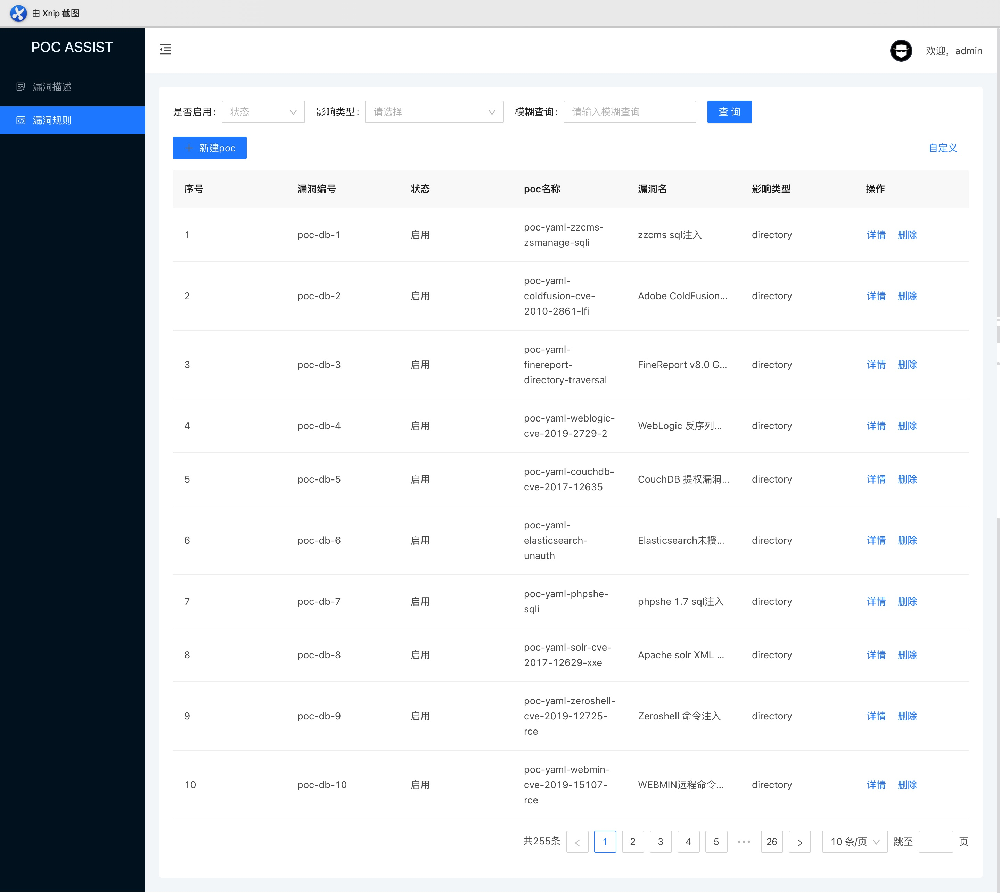

<p align="center">
   
   <h3 align="center">POCASSIST</h3>
   <p align="center">全新的开源漏洞测试框架，支持poc的在线编辑、管理、测试</p>
</p>


pocassist是一款全新的开源漏洞测试框架，无需代码知识也可实现对poc的在线编辑、管理、测试。

pocassist借鉴了xray优秀的规则体系。但这不是一个xray的轮子，也不仅仅只是框架，我希望pocassist能成为帮助安全开发人员只需专注于poc的逻辑实现，而不必的耗费精力开发代码和维护漏洞库。


## 免责声明

未经授权，使用pocassist攻击目标是非法的。pocassist仅用于安全测试目的。

为避免被恶意使用，本项目所有收录的poc均为漏洞的理论判断，不存在漏洞利用过程，不会对目标发起真实攻击和漏洞利用。


## 介绍

- pocassist借鉴了xray优秀的规则体系。基于CEL表达式定义poc规则。
- 不仅仅是xray。pocassist除了支持目录级漏洞的poc，还支持：
  - 服务器级漏洞
  - 参数级漏洞（替换完整参数  /  在参数后拼接url）
  - url级漏洞
  - 页面内容检测
  - 如果以上还不满足你的需求，还支持加载自定义脚本进行检测

- poc在线编辑。提供了前端UI，可对poc规则进行在线编辑。
- 所有poc均以json格式存入数据库。因此支持批量加载poc，对批量资产进行漏洞检测。批量加载poc时，支持自定义搜索条件指定执行哪些poc。
- 实现内存复用以及对并发的颗粒度控制。使用更少的请求，更少的内存资源进行漏洞检测。
- 支持命令行启动和web端启动。web端使用 gin + react 开发。


所以...

你可以使用pocassist作为自己的poc管理平台，可以方便快捷的进行在线poc管理&编辑&测试...

你也可以直接通过pocassist对目标进行批量漏洞验证...

你还可以在你的漏洞测试工具里通过命令行 / api 调用 pocassist...

或许你想研究xray是如何解析规则进行检测的，也可以看下pocassist...


### web

前端UI使用 react + antd开发。已单独拆分成一个项目，有兴趣的可以单独看这里：

https://github.com/jweny/pocassistweb




poc在线编辑：


poc测试（漏洞检测）：


### cli

通过命令行对目标url进行验证：


## 快速开始

### 部署

1. 从release中下载相应系统版本的zip文件，其中包括：

- 二进制文件：pocassist
- 配置文件：config.yaml
- 数据库文件：sqlite(pocassist.db) + mysql(pocassist.sql)

2. 编辑config.yaml，配置数据库以及其他个性化配置

3. 运行

- 如果使用默认端口（默认端口：1231）：`./pocassist server`
- 如果使用其他端口，如8888：`./pocassist server --port 8888`
- 默认使用sqlite数据库，如果使用mysql请自行建库导数据。

### 开发

#### api

```
git clone https://github.com/jweny/pocassist.git

cd pocassist

go build -o pocassist

# 创建数据库。修改config.yaml

./pocassist
```

#### 前端

develope模式下前端默认运行在3333端口 

后端在craco.config.js中配置，默认为`127.0.0.1:1231`

```
cd pocassist/web

yarn start
```


## 使用


### web

```
./pocassist server -p 端口
```

==========详细的web界面使用手册正在疯狂编写中==============

### cli

```
./pocassist cli -h
```


#### 参数释义

- url参数为检测单个url

- urlFile参数为从文件批量加载url

- urlRaw参数为从文件中加载请求报文

- loadPoc 参数为加载规则的类型，缩写：
  - single为单个规则
  - multi为多个规则
  - all为全部规则
  - affects为加载某种类型的规则

- condition 为 不同loadPoc条件下的查询条件：
  - 当loadPoc为single时，查询条件为：单个pocID

    ```
    ./pocassist cli -lp single -c poc-db-145 -u http://xxx.xxx.xxx.xxx
    # 如果启用debug
    ./pocassist -d cli -lp single -c poc-db-145 -u http://xxx.xxx.xxx.xxx
    ```

  - 当loadPoc为multi时，查询条件为：多个pocID，逗号隔开

    ```
    ./pocassist cli -lp multi -c poc-db-145,poc-db-146,poc-db-147 -u http://xxx.xxx.xxx.xxx
    ```

  - 当loadPoc为all时，不需要查询条件

    ```
    ./pocassist cli -lp all -u http://xxx.xxx.xxx.xxx
    ```

  - 当loadPoc为affects时，查询条件为漏洞类型：directory / server / text / script / url / appendparam / replaceparam

    ```
    ./pocassist cli -lp affects  -c directory -u http://xxx.xxx.xxx.xxx
    ```


## 常问问题

1. 数据库中默认登录的账号密码：admin/admin2

2. 数据库初始化失败 / config.yaml 加载失败：

   一定先创建数据库，导入数据，并将数据库信息更新至config.yaml后，再使用本工具。

   config.yaml要与pocassist二进制文件放置于同一目录中。

3. `go get ./... connection error`

   启用goproxy（请参阅此[文章](https://madneal.com/post/gproxy/)以进行golang升级）：

   ```
   go env -w GOPROXY=https://goproxy.cn,direct
   go env -w GO111MODULE=on
   ```

4. 如果使用前后端分离部署的师傅依旧可以使用0.1.0版本，部署方式

   从release中下载相应系统版本的zip文件，其中包括：

   - pocassist二进制文件

   - 打包好的前端 `build`文件夹

   - config.yaml

     api

   1. 创建pocassist数据库，并将pocassist.sql导入。

   2. 编辑config.yaml，配置数据库以及其他个性化配置

   3. 运行服务端

      - 如果使用默认端口（默认端口：1231）：`./pocassist server`
      - 如果使用其他端口，如8888：`./pocassist server --port 8888`

      web

   4. 准备release中的`build`。

   5. 安装nginx。修改nginx.conf反向代理后端。

   ```
   upstream pocassistAPI {
   				# 配置后端端口
           server 127.0.0.1:1231;
       }
   server {
           listen       80;
           location / {
           		# 配置build文件夹路径
               root /opt/pocassistWEB/build/;
           }
   
           location /api/ {
               proxy_pass http://pocassistAPI/api/;
           }
   
           error_page 404 /404.html;
               location = /40x.html {
           }
   
           error_page 500 502 503 504 /50x.html;
               location = /50x.html {
           }
       }
   ```

   ### 

## todo

- 由于实现的细节较多，详细的规则编辑使用手册正在疯狂编写中

- 修改前端参数级漏洞参数列表不显示的bug

- 前端批量执行多个poc

- server api 优化

- 收集更多的poc

- ~~实现一个二进制走天下：数据库支持sqlite，并将前端打包进二进制~~ 已经搞定

  

## 微信

如果在部署 / 使用过程中遇到问题，或者有好的想法或建议，或者对其他安全工具有改造想法的，欢迎添加我的微信一块交流。

<p align="left">
   
</p>


只聊技术，不扯虚的！


## License

[Apache License 2.0](https://github.com/madneal/gshark/blob/master/LICENSE)


## 参考

- https://github.com/chaitin/xray/tree/master/pocs
- https://phith0n.github.io/xray-poc-generation/
- https://github.com/jjf012/gopoc
- https://codelabs.developers.google.com/codelabs/cel-go#0