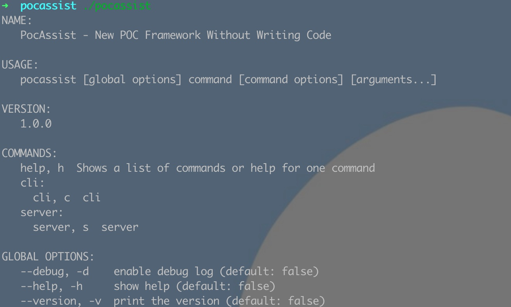

<div align="center">
	
</div>

pocassist是一款全新的开源漏洞测试框架，无需代码知识也可实现对poc的在线编辑、管理、测试。

pocassist借鉴了xray优秀的规则体系。但这不是一个xray的轮子，也不仅仅只是框架，我希望pocassist能成为帮助安全开发人员只需专注于poc的逻辑实现，而不必的耗费精力开发代码和维护漏洞库。


## 免责声明

未经授权，使用pocassist攻击目标是非法的。pocassist仅用于安全测试目的。

为避免被恶意使用，本项目所有收录的poc均为漏洞的理论判断，不存在漏洞利用过程，不会对目标发起真实攻击和漏洞利用。


## 介绍

- pocassist借鉴了xray优秀的规则体系。基于CEL表达式定义poc规则。
- 不仅仅是xray。pocassist除了支持目录级漏洞的poc，还支持：
  - 服务器级漏洞
  - 参数级漏洞（替换完整参数  /  在参数后拼接url）
  - url级漏洞
  - 页面内容检测
  - 如果以上还不满足你的需求，还支持加载自定义脚本进行检测

- poc在线编辑。提供了前端UI，可对poc规则进行在线编辑。
- 所有poc均以json格式存入数据库。因此支持批量加载poc，对批量资产进行漏洞检测。批量加载poc时，支持自定义搜索条件指定执行哪些poc。
- 实现内存复用以及对并发的颗粒度控制。使用更少的请求，更少的内存资源进行漏洞检测。
- 支持命令行启动和web端启动。web端使用 gin + react 开发。


所以...

你可以使用pocassist作为自己的poc管理平台，可以方便快捷的进行在线poc管理&编辑&测试...

你也可以直接通过pocassist对目标进行批量漏洞验证...

你还可以在你的漏洞测试工具里通过命令行 / api 调用 pocassist...

或许你想研究xray是如何解析规则进行检测的，也可以看下pocassist...


### web端

#### 漏洞管理

漏洞表：


漏洞详细信息编辑：


#### poc编辑测试

poc表：


poc编辑页：


在`测试url`中输入url，点击`测试规则按钮`，将 根据`规则类型`和`poc中定义的规则`进行漏洞检测。


### 命令行

通过命令行对目标url进行验证：


## 安装

暂时可下载源码编译安装，下一版将提供编译好的二进制 && 打包好的前端 && Docker镜像。

```
git clone https://github.com/jweny/pocassist.git

cd pocassist

go build -o pocassist

# 创建数据，导入数据，修改config.yaml

./pocassist
```

## 使用



### web端

```
# 启动web后端 默认1231端口

./pocassist server 

# 启动web前端 默认3333端口 如果后端使用自定义端口可编辑 craco.config.js

cd pocassist/web

yarn start
```

==========详细的web端使用手册正在疯狂编写中...==============

### 命令行

```
./pocassist cli -h
```


- url参数为检测单个url
- urlFile参数为从文件批量加载url
- urlRaw参数为从文件中加载请求报文

- loadPoc 参数为加载规则的类型，缩写：
  - single为单个规则
  - multi为多个规则
  - all为全部规则
  - affects为加载某种类型的规则

- condition 为 不同loadPoc条件下的查询条件：
  - 当loadPoc为single时，查询条件为：单个pocID

    ```
    ./pocassist cli -lp single -c poc-db-145 -u http://xxx.xxx.xxx.xxx
    # 如果启用debug
    ./pocassist -d cli -lp single -c poc-db-145 -u http://xxx.xxx.xxx.xxx
    ```

  - 当loadPoc为multi时，查询条件为：多个pocID，逗号隔开

    ```
    ./pocassist cli -lp multi -c poc-db-145,poc-db-146,poc-db-147 -u http://xxx.xxx.xxx.xxx
    ```

  - 当loadPoc为all时，不需要查询条件

    ```
    ./pocassist cli -lp all -u http://xxx.xxx.xxx.xxx
    ```

  - 当loadPoc为affects时，查询条件为漏洞类型：directory / server / text / script / url / appendparam / replaceparam

    ```
    ./pocassist cli -lp affects  -c directory -u http://xxx.xxx.xxx.xxx
    ```

## todo

- 由于实现的细节较多，详细的规则编辑使用手册正在疯狂编写中

- 修改前端参数级漏洞参数列表不显示的bug

- 前端批量执行多个poc

- 发现潜在的bug

- server api 优化

  

## 参考

- https://github.com/chaitin/xray/tree/master/pocs
- https://phith0n.github.io/xray-poc-generation/
- https://github.com/jjf012/gopoc
- https://codelabs.developers.google.com/codelabs/cel-go#0