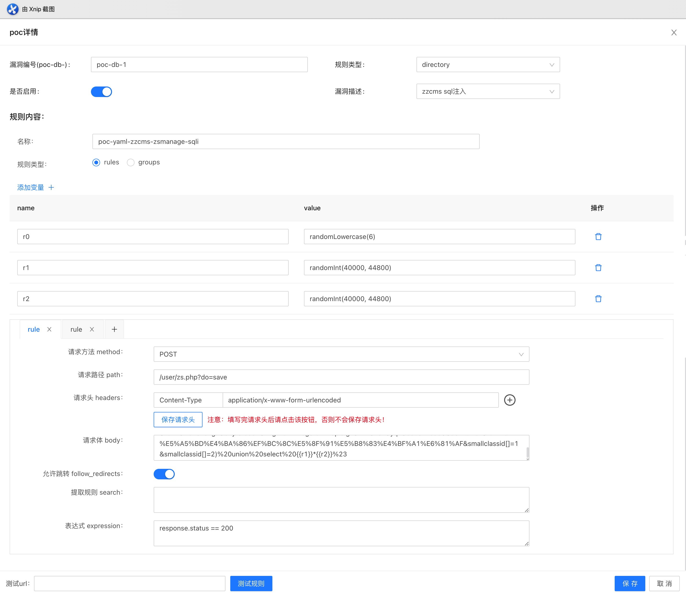
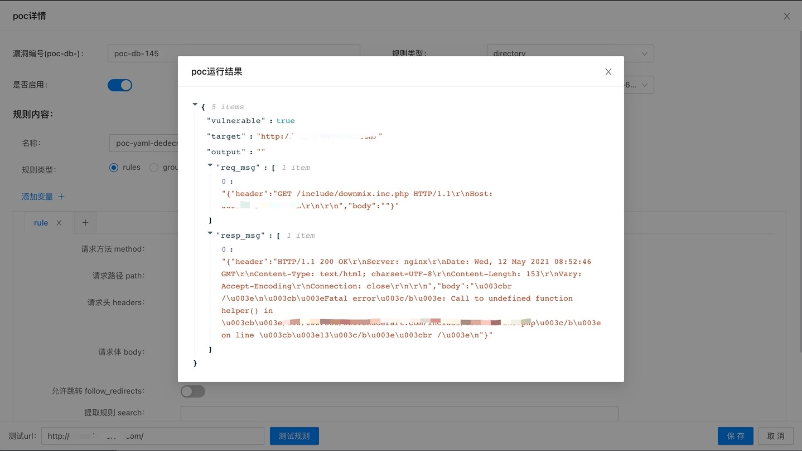
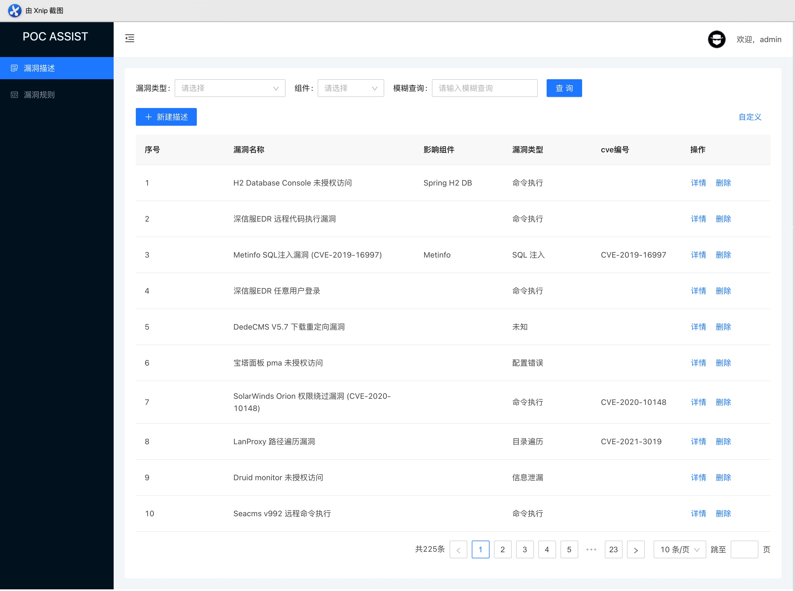
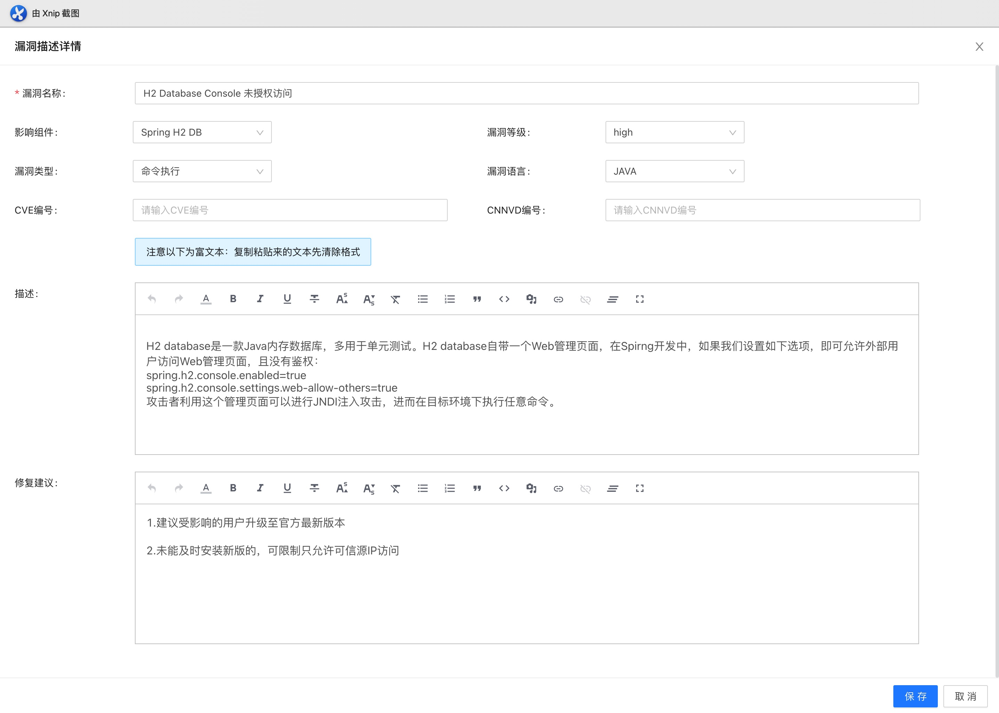

<p align="center">
   
</p>


## pocassist

pocassist是一个 Go (Golang) 编写的全新的开源漏洞测试框架，实现对poc的在线编辑、管理、测试。

如果你不想撸代码，又想实现poc的逻辑，又想在线对靶机快速测试，那就使用pocassist吧。

## 特性

### 规则体系

- pocassist借鉴了xray优秀的规则体系。通过基于CEL表达式定义poc规则。

- 完全兼容xray现有规则。

- 不仅仅是xray。pocassist除了支持定义目录级漏洞poc，还支持服务器级漏洞、参数级漏洞、url级漏洞以及对页面内容检测，如果以上还不满足你的需求，还支持加载自定义脚本。

### 性能

高并发：支持批量运行poc，通过使用 `ants`实例化协程池，复用 goroutine ，节省资源，提升性能。

### 资源

小内存占用：使用内存复用机制。每个poc / 请求 / 响应 均使用`sync.Pool` 来缓存对象，减轻GC消耗。

### 易用

pocassist 为单二进制文件，无依赖，也无需安装，下载后直接使用。

## Demo


### poc管理


poc在线编辑



poc在线运行



### 漏洞管理

每个poc可以关联配套的漏洞描述。





## 快速开始

### 下载

直接下载相应系统构建的二进制文件即可，下载时选择最新的版本。

下载地址：https://github.com/jweny/pocassist/releases/

### 运行

pocassist分为两种模式：

- web：提供web页面进行在线poc编辑和测试
- cli：提供批量扫描功能

如使用默认配置，可直接运行二进制文件。这里以pocassist_darwin_amd64为例：

 `./pocassist_darwin_amd64 -h`

#### web端

运行web端，默认1231端口。：

`./pocassist_darwin_amd64 server`

自定义端口，如8888：

`./pocassist_darwin_amd64 server -p 8888`

默认账号密码：`admin/admin2`

#### cli

如果想进行批量poc测试，可使用命令行：

`/pocassist_darwin_amd64 cli -h`

### 使用手册

命令行参数详细说明、配置文件说明、web端操作可参考[使用手册](https://github.com/jweny/pocassist/wiki/%E4%BD%BF%E7%94%A8%E6%89%8B%E5%86%8C)。

## 常见问题

1. config.yaml 加载失败：config.yaml要与pocassist二进制文件放置于同一目录中。

2. 使用mysql时，数据库初始化失败：如果后端使用mysql数据库，一定先创建数据库，导入数据，并将数据库信息更新至config.yaml后，再运行pocassist。

3. 目前前端有一个小bug，首次登陆成功之后，跳转至/vul时会显示空，需要强制刷新下。

4. `go get ./... connection error`

   启用goproxy（请参阅此[文章](https://madneal.com/post/gproxy/)以进行golang升级）：

   ```
   go env -w GOPROXY=https://goproxy.cn,direct
   go env -w GO111MODULE=on
   ```

5. 如果使用前后端分离部署的师傅可自行打包前端。

   https://github.com/jweny/pocassistweb

## todo

- 目前cli端的批量快扫功能为临时方案，后续所有批量快扫功能web端都将支持。
- 发现潜在bug
- json参数解析
- 修复前端bug
  - 初次加载时要强制刷新
  - 参数级扫描：payload列表前端未提供在线编辑

## 微信

如果在部署 / 使用过程中遇到问题，或者有好的想法或建议，欢迎添加我的微信进行交流。

<p align="left">
   
</p>


## 免责声明

未经授权，使用pocassist攻击目标是非法的。pocassist仅用于安全测试目的。为避免被恶意使用，本项目所有收录的poc均为漏洞的理论判断，不存在漏洞利用过程，不会对目标发起真实攻击和漏洞利用。

## 参考项目

- https://github.com/chaitin/xray/tree/master/pocs
- https://phith0n.github.io/xray-poc-generation/
- https://github.com/jjf012/gopoc
- https://codelabs.developers.google.com/codelabs/cel-go#0