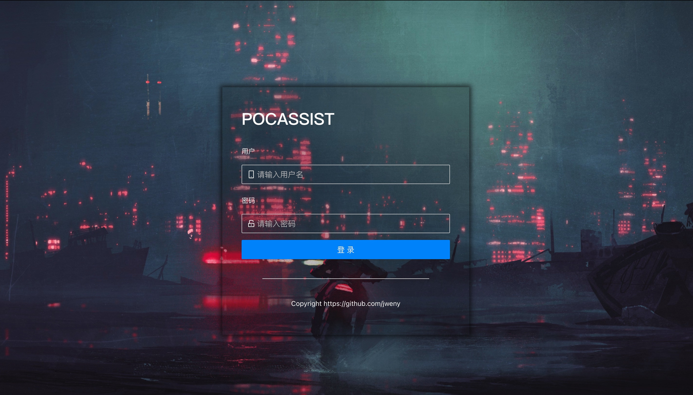
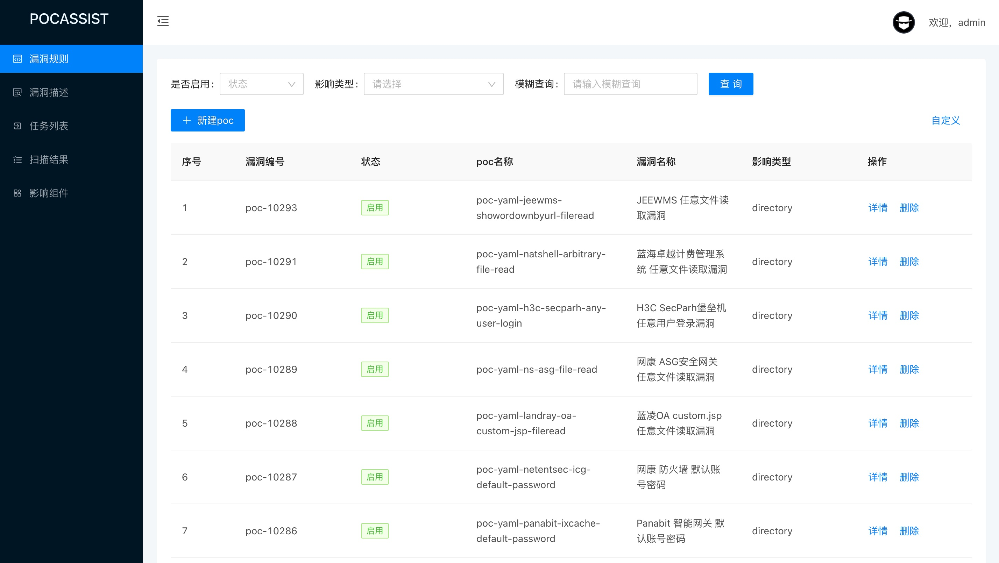
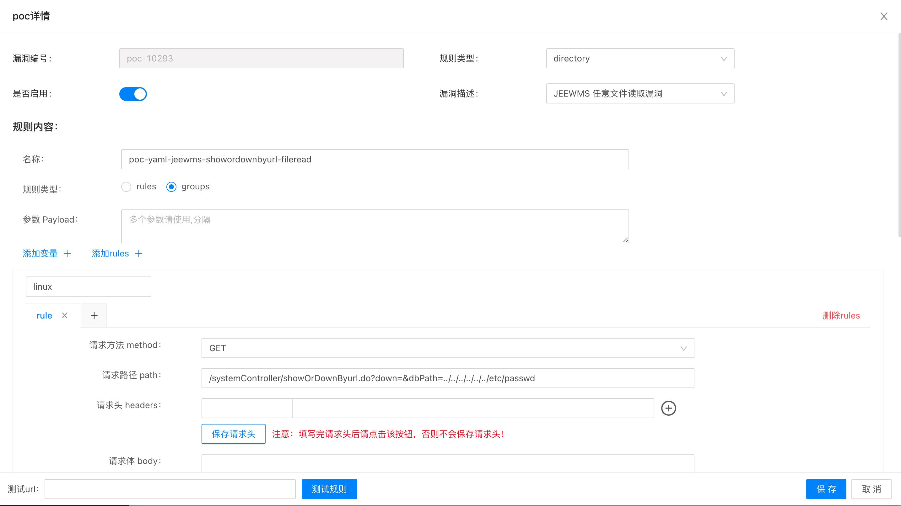
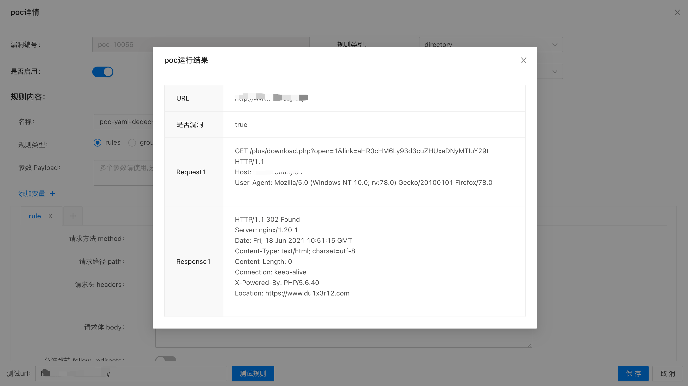
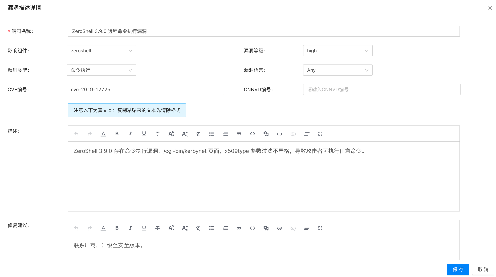
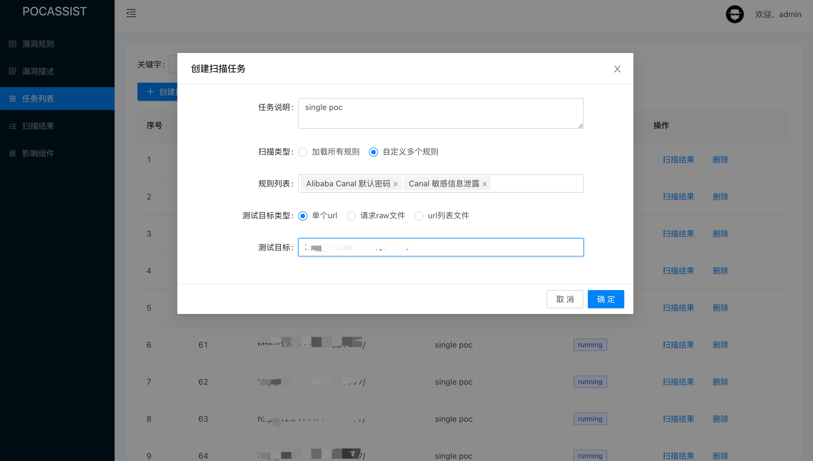
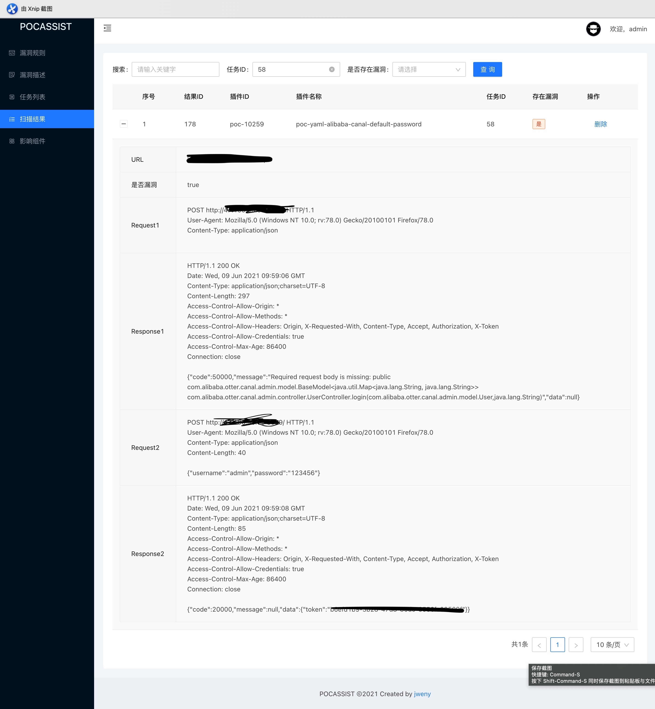
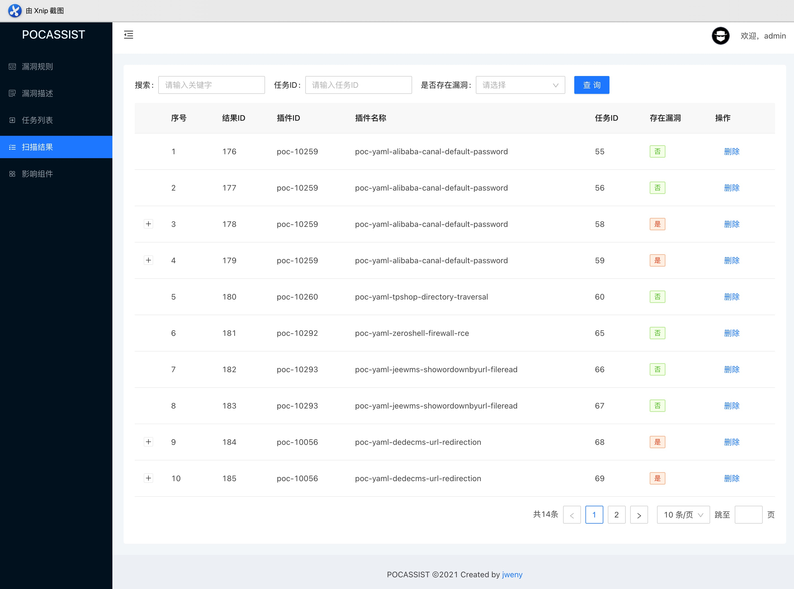
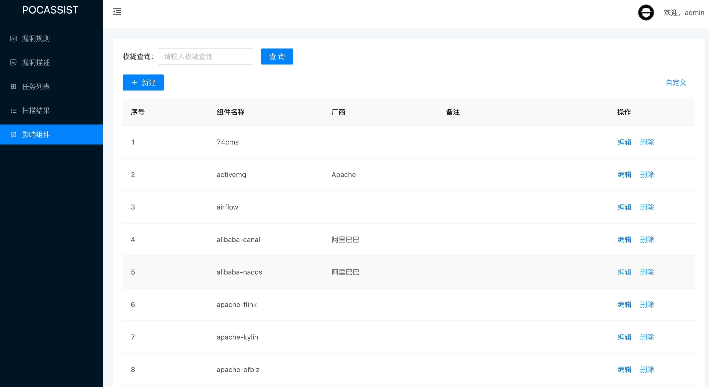

pocassist是一个 Golang 编写的全新开源漏洞测试框架。

- 简单易用
  - 只需要在前端编辑，即可生成poc对批量目标进行测试
  - 单二进制文件，无依赖，也无需安装
- 性能优秀
  - 支持高并发，通过使用 `ants`实例化协程池，复用 goroutine
  - 多重内存复用，尽可能小的内存占用
- 规则体系
  - 完全兼容xray，但又不仅仅是xray。除了支持定义目录级漏洞poc，还支持服务器级漏洞、参数级漏洞、url级漏洞以及对页面内容检测，如果以上还不满足你的需求，还支持加载自定义脚本。

使用之前务必先阅读使用文档！

🏠[使用文档](https://pocassist.jweny.top/)	⬇️[下载最新版本](https://github.com/jweny/pocassist/releases)

## 快速开始

### 像数 1, 2, 3 一样容易

```bash
# 启动服务
./pocassist

# 浏览器访问 
http://127.0.0.1:1231
```

建议使用[pocassistdb](https://github.com/jweny/pocassistdb)作为漏洞库。⬇️[下载漏洞库最新版本](https://github.com/jweny/pocassistdb/releases/)，并在`config.yaml `的`sqlite`项配置路径。

有想一块维护poc的师傅也可直接向该项目提PR。

## 微信

如果在部署 / 使用过程中遇到问题，或者有好的想法或建议，欢迎添加进群沟通，或者添加我的微信进行交流。

<p align="left">
   
   
</p>

## Demo

登录页



规则首页



规则详情



单挑规则靶机测试



漏洞描述首页


漏洞描述详情



新建批量扫描任务



任务状态


扫描结果



结果首页



组件首页



## 常见问题

1. 自定义配置。pocassist首次运行时将在当前目录生成`config.yaml`，引擎启动后实时监控配置文件变化，配置文件修改后无需重启，即热加载
2. 用户名密码错误：检查数据库配置，以及数据库auth表。建议使用[pocassistdb](https://github.com/jweny/pocassistdb)作为漏洞库
5. 支持前后端分离部署。前端源码、nginx配置示例可参考[pocassistweb](https://github.com/jweny/pocassistweb)
4. 其他使用问题请先阅读[使用文档](https://pocassist.jweny.top/)


## 免责声明

未经授权，使用pocassist攻击目标是非法的。pocassist仅用于安全测试目的。为避免被恶意使用，本项目所有收录的poc均为漏洞的理论判断，不存在漏洞利用过程，不会对目标发起真实攻击和漏洞利用。

## 404StarLink 2.0 - Galaxy


pocassist 是 404Team [星链计划2.0](https://github.com/knownsec/404StarLink2.0-Galaxy) 中的一环，如果对 pocassist 有任何疑问又或是想要找小伙伴交流，可以参考星链计划的加群方式。

- [https://github.com/knownsec/404StarLink2.0-Galaxy#community](https://github.com/knownsec/404StarLink2.0-Galaxy#community)

## 参考项目

- https://github.com/chaitin/xray/tree/master/pocs
- https://phith0n.github.io/xray-poc-generation/
- https://github.com/jjf012/gopoc
- https://codelabs.developers.google.com/codelabs/cel-go#0
- https://github.com/projectdiscovery/nuclei
- https://github.com/projectdiscovery/nuclei-templates/

